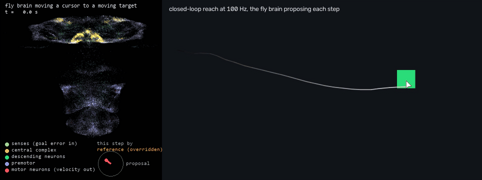

# Ganglion

A fly-brain reflex layer for LLM agents: frame-rate perception of the screen, pre-armed snap
reactions and closed-loop motor programs at 100 Hz, directed by Claude Code or Codex over MCP.
The fast loop runs inside a seat (a second, isolated Windows session provided by an external
tool) or on the console; the brain comes from [Haltere](https://github.com/skulitom/haltere),
the male-CNS fly connectome that flies a drone in Liftoff.



*Left: the 30,000 neurons of the fly connectome drawn at their real positions in the male CNS
(brain on top, nerve cord below), brightening as they fire; the dial shows the velocity the
motor neurons propose and the line above it who made the step: the fly brain, or the
deterministic reference when the supervisor turned a proposal down. Right: the headless reach
demo. The same target is first clicked by a client that looks, takes a quarter of a second to
decide and clicks, twice a second, which is how an agent's turns arrive: the clicks land where
the target was. Then Ganglion's closed-loop reach takes over from wherever the pointer was
left, follows the target at 100 Hz with the fly brain proposing each step, and hits it in
0.3 to 0.6 s. The brain is at rest between reaches because
the model runs only while a motor program does. The rates are not an animation: the ledger
records every input the model was given, and the panel is the same checkpoint run over them
again, its proposals agreeing with the logged ones to 0.001
([how the clips are made](docs/media/README.md), [video](docs/media/reach.mp4)).*

Status: Gate C demonstrated; Gate D connectome experiments running on a working system. See
[STATUS.md](STATUS.md). The control path uses deterministic colour perception and cursor-feedback
reach/drag. Haltere's actual 30,000-neuron model receives the same motor observations in a
separate worker and, when an intent asks for it, drives the pointer under a supervising envelope
that only lets a proposal through when it brings the cursor closer to the goal. In live Sawayama
Solitaire drags it produced 90.6% of the accepted pointer commands. Generic cursor training adapts
the fly model's motor readout and sensory encoders; the candidates are still experimental and
cannot yet finish a reach unaided. See [the connectome experiment](docs/bench/SHADOW.md) and
[training results](docs/bench/TRAINING.md).
Read [PLAN.md](PLAN.md) for
the design, the target set and the phases; `suggestions/` holds an external review of the plan
that shaped its runtime contracts and delivery gates.

## Setup

```bash
uv sync --locked --extra dev
.venv/Scripts/python.exe -m pytest -q
.venv/Scripts/python.exe -m ruff check ganglion tests
```

CI runs the same lint and test commands on every push; the lint rules live in `pyproject.toml`.

The deterministic runtime needs no torch, Haltere assets, GPU, or gamepad driver. Install those
separately for the optional brain benchmark and shadow experiments; direct `.venv` commands preserve such extra packages.

## Run the reflex demonstration

```bash
.venv/Scripts/python.exe -m ganglion.cli demo --synthetic --seconds 5
.venv/Scripts/python.exe -m ganglion.cli demo --seconds 8 --json runs/reflex.json
```

The first command is headless. The second opens a temporary Arena window and uses real capture
and input in the current Windows session; run it inside the seat for a separate desktop.
The agent arms a reflex through MCP, leaves it alone, then retrieves the ledger and scorecard.

See [runtime setup and MCP tools](docs/RUNTIME.md) for resident use, teaching, lease renewal,
coordinate transforms, and limitations. [Recorded runs](docs/bench/results/) include console,
seat, and synthetic demonstrations.

## Run the closed-loop comparison

```bash
.venv/Scripts/python.exe -m ganglion.cli reach-demo --environment synthetic --trials 4
.venv/Scripts/python.exe -m ganglion.cli reach-demo --environment arena --trials 4 --json runs/reach.json
```

The same `ganglion_intent` tool reaches a moving colour target, confirms cursor arrival, and
optionally clicks. The comparison uses a periodic agent baseline with an explicit 250 ms decision
delay. See the [scorecard and limitations](docs/bench/REACH.md).

For the browser fixture, install the optional `browser` extra and use an existing Microsoft Edge:

```bash
uv sync --locked --extra dev --extra browser
.venv/Scripts/python.exe -m ganglion.cli reach-demo --environment browser --trials 4 --json runs/browser-reach.json
```

It opens an isolated temporary browser. Playwright manages fixture setup and records ground
truth; Ganglion sees captured pixels and sends ordinary Windows input.

## Run the drag checks

```bash
.venv/Scripts/python.exe -m ganglion.cli drag-demo --environment synthetic --trials 2
.venv/Scripts/python.exe -m ganglion.cli drag-demo --environment arena --trials 2 --json runs/drag.json
.venv/Scripts/python.exe -m ganglion.cli drag-demo --environment browser --trials 2 --json runs/browser-drag.json
```

Each seed checks a quiet-screen reach, early release on a taught visual condition, accepted and
rejected drops, and cancellation while held. An independent helper bounds each drag hold; fresh
samples after release verify the condition. Quiet desktops use actual GDI acquisitions alongside
DXGI. See the [drag scorecard and limits](docs/bench/DRAG.md).

The same drag primitive plays Sawayama Solitaire in real time inside the seat: an evaluation
harness reads the board from captured frames with taught glyph templates, picks a move, and
executes it through the public MCP tools, with the deterministic or the connectome controller.
The card logic stays outside the core and exists to keep real drags flowing, not to win games.
See the [Solitaire scorecard](docs/bench/SOLITAIRE.md).

```bash
.venv/Scripts/python.exe -m ganglion.evaluation.solitaire.player --endpoint runs/solitaire.endpoint.json --out runs/solitaire-play/example --session 2 --dry-run
```

## First person

In Half-Life inside the seat, the core turns the view with relative mouse deltas, holds keys
continuously, tracks the thing that just moved and fires when aligned, with the connectome
proposing the view velocity under the same envelope. See the [Half-Life scorecard](docs/bench/HALFLIFE.md).

## Measuring the model

`ganglion.train.suite` scores the deterministic reference, an MLP, the connectome and the
supervised connectome on identical settling, jump, pursuit and camera episodes;
`ganglion.arena.compare` scores live reach demos from the ledger the same way. A `flow` watch
sees what moves on its own while the view itself moves. See [training](docs/bench/TRAINING.md)
and [the connectome experiment](docs/bench/SHADOW.md).

## Phase 0 tools

```bash
ganglion doctor            # session kind, screen, capture path, torch/CUDA, Haltere brain, ViGEm, seat frame cap
ganglion bench             # capture rate and latency, input-to-pixel latency, brain step time, tick jitter
ganglion bench --json docs/bench/results/console.json
```

Run the same bench inside the seat (through its run tool) to get the seat column.

## Layout

```
ganglion/core      capture, leases, watches and reflexes (perception.py), reach/drag/align/move programs, ledger, input helper, NDJSON service
ganglion/percepts  application-independent detectors: colour components, motion, template tracking, optic flow
ganglion/mcp       thin MCP stdio bridge to the resident core
ganglion/arena     headless and real-window target worlds, MCP demo, timing flasher
ganglion/evaluation opt-in application checks through MCP; solitaire/ is the real-time Sawayama harness
ganglion/brain     optional actual-connectome shadow inference and frozen replay
ganglion/train     headless cursor imitation, DAgger, fine-tuning and the fixed evaluation suite
ganglion/bench     the measurements that decide tick rates and latency compensation
ganglion/doctor.py what is installed and which session we are in
docs/census        census of the local male-CNS connectome (scripts and outputs)
docs/bench         scratch benchmarks that preceded `ganglion bench`, and results
scripts/           set-seat-fps.ps1: raise the RDP frame cap for seats (admin, reboot)
skills/            agent guidance for using Ganglion's tools
```

Source code is released under the [MIT license](LICENSE). Model checkpoints and training runs
are kept outside Git. The two cursor readouts documented in [TRAINING.md](docs/bench/TRAINING.md)
(v6, the live configuration, and v3b, the one that stands on its own) are published with their
reports at [huggingface.co/Skulitom/ganglion-haltere-cursor](https://huggingface.co/Skulitom/ganglion-haltere-cursor)
and as a GitHub release; the model card states what they do and do not do. External models, datasets and application
screenshots retain their original terms.
