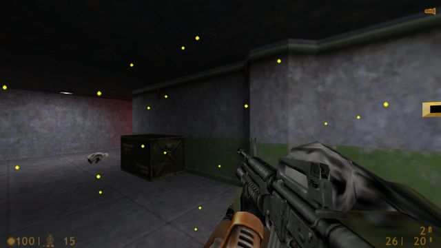
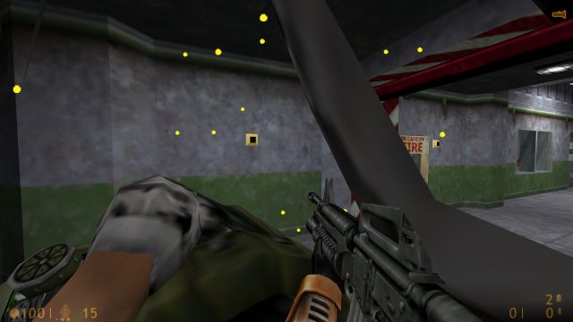

# Half-Life through the reflex layer

First live first-person test, 2026-09-17, inside the Anode seat at 1280×720 (Half-Life, Steam
app 70, build 15961492, OpenGL, `m_rawinput 1`). The core bound the game window by process id
and ran with the DAgger cursor checkpoint loaded. An agent-driven pilot
(`ganglion.evaluation.halflife.pilot`) kept one lease alive and issued high-level commands;
everything at frame rate happened in the core.

## What the core does now

- **Keys, relative look and button holds** as bounded inputs: `hold` renews up to four keys
  (never past one second per command), `look` sends relative mouse counts, optionally spread
  over chunks 10 ms apart, `button` holds a mouse button without moving the pointer. The
  independent helper releases all of them on deadline, halt or producer death.
- **Motion watches** report the largest blob that changed against a frame 60 ms older, on a
  ratio-to-local-brightness image so flashing lights cancel, only after a short persistence, and
  never while the runtime's own commands move the view or the player.
- **Track watches** follow a crop by normalised cross-correlation in a search window, adapting
  the template slowly and reporting loss after repeated misses. A `track` reflex cuts the
  template around the blob a motion watch just found, so the turn itself no longer blinds the
  program.
- **Align** turns the view with relative deltas until the tracked target sits at the crosshair,
  then holds fire in bursts; with `controller: connectome` the model proposes the view velocity
  every tick against a virtual cursor/goal pair and the same supervising envelope as reach.
- **Move** holds keys continuously, renewed every 100 ms by the runtime, until a condition,
  duration, cancellation or fault; it runs beside a pointer program.
- A whole-view **change** energy in every snapshot lets a pilot notice it is blocked.

## Recorded engagement

Two fights against grunts spawned with the console (`give monster_human_grunt`: one, then
three at once) in the corridor before Silo D, with the motion → track → connectome align → fire
chain armed and the agent not aiming. The [ledger summary](results/halflife/grunt-fights-2026-09-17.json)
covers the whole pilot session, including the false alarms on the elevator door and the alarm
light before the percept was made illumination-invariant.

| Measurement | Pilot session |
|---|---:|
| Reflex firings / align intents | 58 / 58 |
| Intents that aligned and fired | 15 (68 bursts) |
| Intents ending in target loss or timeout | 40 |
| View commands from the connectome / overridden | 5,071 / 1,233 (80.4%) |
| Acquisition to first shot | 0.11–3.76 s, median about 1.3 s |
| Damage taken | none; all four grunts died |




The player never took damage and the grunts died, but the numbers also show what is not yet
right: many intents timed out while the tracker chased shell casings or a target that kept
strafing, the model's share fell to about a quarter against fast-moving targets, and a burst
is fired only after settling, which costs up to three seconds. Weapon switching and reloading
by reflex worked mechanically but their colour cues (red digits, damage indicator) misfired
under the level's red emergency lighting, so they were disarmed. Traversal is still mostly the
agent's: the pilot's explore/seek behaviour bumps and turns on the change sense and stops on a
goal or motion, which got it out of the elevator but not through the level.

## Second engagement: the motion channel fed live

Same corridor, later the same day, with the adapter-v4 checkpoint (the visual slip of a turning
view trained into the lptc channel), the model in its own process with the polling wait, and a
flow watch over the upper view feeding that channel live (`core --shadow-process
--lptc-from-flow`). Another session had Liftoff loaded in the same seat; with it rendering in
the background the first attempt's capture stalled and the core halted before the fight (127
dropped observations in forty seconds). Minimising it and running the flow at eighth scale gave
a clean run: 4 dropped observations in 4,686 view
commands. Two grunts were spawned against the player in the elevator, so the fight was
point-blank ([ledger summary](results/halflife/lptc-engagement-2026-09-17.json)).

| Measurement | This session | First session |
|---|---:|---:|
| View commands | 4,686 | 6,304 |
| From the model / overridden / stale | 56.1% / 37.7% / 6.2% | 80.4% / 19.6% / not counted |
| Reflex firings, align intents that fired | 41, 8 | 58, 15 |
| Inference p50 / p95 / p99 | 4.6 / 8.8 / 10.1 ms | not in the scorecard |
| Damage taken | none | none |

Two findings. Inference stayed inside the evidence budget throughout the fight, so the
out-of-process worker and the polling wait hold up in a game, not only in the Arena. And the
live flow did not match the simulated slip: over 4,303 samples with turns above
100 px/s, the flow's translation was 0.22 of the turn the runtime
had applied 60 ms earlier (median 512 px/s against 1083),
with a correlation of 0.22. The scene explains most of it: a dark elevator
with the grunts filling the view leaves the phase correlation and the dense flow little
texture, and the flow's comparison window straddles the fast turns the align program makes
(up to 80 counts per tick). The v4 readout, trained on a slip that tracks the view exactly, was
overridden more than the first session's readout; whether that is the mismatch or the readout
cannot be told apart here. The calibration turn below settles what the percept reports.

## Calibration: what the flow percept reports for a known turn

The next day, in the same elevator with the doors open, the pilot's `calibrate` op swept the
view right then left at each of eight rates (a spread `look` of half a second, a quarter above
2,500 px/s), sampling the snapshot's flow summary about every 20 ms during and after each
sweep, with the flow watch over the upper 1280×560 at eighth and at quarter scale
([results](results/halflife/flow-calibration-2026-09-18.json)). "Applied" is the rate the
counts should produce at 1.067 counts per pixel, the figure the pilot's aim uses.

| Turn (px/s) | Reported / applied, scale 8 | Phase response, scale 8 | Reported / applied, scale 4 | Phase response, scale 4 |
|---:|---:|---:|---:|---:|
| 300 | 0.85 (0.80 to 0.89) | 0.93 | 0.92 (0.92 to 0.93) | 0.95 |
| 600 | 0.88 (0.88 to 0.88) | 0.94 | 0.93 (0.92 to 0.93) | 0.85 |
| 1,000 | 0.86 (0.86 to 0.86) | 0.88 | 0.91 (0.90 to 0.91) | 0.71 |
| 1,500 | 0.84 (0.83 to 0.85) | 0.89 | 0.87 (0.86 to 0.89) | 0.72 |
| 2,500 | 0.80 (0.79 to 0.81) | 0.75 | 0.82 (0.81 to 0.84) | 0.46 |
| 4,000 | 0.72 (0.70 to 0.75) | 0.64 | 0.75 (0.66 to 0.83) | 0.47 |
| 6,000 | 0.70 (0.69 to 0.71) | 0.22 | 0.65 (0.64 to 0.66) | 0.25 |
| 8,000 | 0.28 (0.11 to 0.45) | 0.10 | 0.43 (0.20 to 0.67) | 0.07 |

Three things follow. **Timing matches training.** The flow at a sample time is best explained
by a 60 ms box of view motion ending 20 ms before the sample (correlation
0.994), which is exactly the training world's model of the percept (a 60 ms window seen
two ticks late). Half the response arrives 92 ms after the command
(p90 107 ms), the box's half width plus the command's own dispatch.
**Scale is the projection, not the percept.** The reported motion is 0.8 to 0.9 of "applied"
at the rates that matter, and the shortfall is in the applied figure: 1.067 counts per pixel
spreads 90° evenly over 1,280 px, but in a 90° perspective view the centre moves about 0.79
times as far per count as that average, and the percept measures the picture. No scale
correction was applied. **The range ends near 7,000 px/s.** The percept holds about 0.7 of the
turn at 4,000 to 6,000 px/s, then breaks: a third of the field over the lag is the phase
correlation's alignment limit, and the dense flow alone cannot follow such a shift.

Re-reading the fight's ledger by the rate applied in the 60 ms before each sample shows the
live flow was poor at every rate, not only the fast ones (median reported / applied 0.56 at
100 to 500 px/s, 0.45 at 1,000 to 2,000, 0.19 at 4,000 to 7,000; the best lag window on that
ledger correlates at 0.22), and it reported up to 500 px/s (90th percentile) while nothing was
applied. That is the scene: two grunts filling a point-blank view are the majority of the
picture, and their motion, not the view's, is what the fit followed. Three changes came out of
this. The flow summary now carries a `credible` flag (the alignment inside the percept's range
and at least half the sampled vectors agreeing with it), the affine fit is seeded with the
phase correlation's shift so a large mover cannot drag it, and the runtime hands the lptc
channel only a credible summary (zeros otherwise, the value the cursor episodes trained with).
The pilot's `engage` op caps the align step at 2,500 px/s of view motion (30 counts a tick at
its gain) instead of 80 counts (6,700 px/s), inside both the percept's range and the training
world's speeds.

## The channel fed against zeros: repeated engagements

The same night, with these changes, `ganglion.evaluation.halflife.trials` ran blocks of five
engagements from one quicksave in the corridor outside the elevator: quickload, two grunts
spawned from the console, a step back, the motion → track → connectome align → fire chain
armed, fourteen seconds of fight, disarm. The v4 checkpoint ran in its own process with
`--lptc-from-flow` throughout; the condition was the flow watch (eighth scale over the upper
view), present for the "fed" blocks and absent for the "zeros" blocks, so the adapter fed the
channel either the credible live summary or nothing. Blocks alternated; the ledger was sliced
per trial ([results](results/halflife/channel-trials-2026-09-18.json)).

| Measurement | Channel fed (flow watch) | Channel zeros (no flow watch) |
|---|---:|---:|
| Trials | 20 | 20 |
| View commands | 8,602 | 8,850 |
| From the model | 68.3% | 88.8% |
| Overridden | 27.0% | 7.1% |
| Stale | 4.7% | 4.1% |
| Align intents, of which fired | 81 of 98 (83%) | 72 of 98 (73%) |
| Acquisition, median (p75) | 1.88 s (2.64) | 2.13 s (2.78) |
| Tracking error of align steps, median of trial means (IQR) | 153 px (138 to 165) | 143 px (122 to 183) |
| Model samples carrying a credible flow | 7,742 | 0 |
| Inference p95, median over trials | 5.9 ms | 6.3 ms |

Twenty trials each. With the channel fed, the chain fired on 83% of its align intents against 73% with zeros and reached the target 0.25 s sooner at the median, but neither difference is significant at this size (two-sided p 0.12 and 0.11), the tracking error of the align steps was no better (p 0.57), and the model was overridden about four times as often (27% of steps against 7%; per-trial model share p 2e-06). The live channel changes what the model proposes, mostly into disagreement with the envelope, so whatever the outcome gained is as likely the envelope's deterministic steps as the model's. What the calibration and these trials establish is that the channel can be fed faithfully and that the v4 readout does not use it well live; its value for the model is not shown. The next lever is training: a readout that sees the slip present, absent and scaled (slip dropout, blanking and gain in the training world, `--slip-dropout`, `--slip-blank`, `--slip-gain`) so that it neither depends on the channel nor is thrown by it.

Where the proposals point says why. Over every align step the model was asked for, its proposal's
cosine with the goal error averaged +0.82 with the channel at zero (90% of proposals
within 60° of the goal, 7% pointing away) and +0.37 with it fed (56% and
26%); and against the flow it was given, the fed proposals averaged a cosine of
-0.46, 62% of them within 60° of *opposite* to the flow. The readout turns
against the slip, which in the training world is the same as continuing its own turn: the slip
there is minus the view's own motion and nothing else, so the channel handed back the
own-velocity shortcut that adapter v3 had removed from the haltere channel. Live, the flow also
carries the grunt's motion at point blank, the two cues disagree, and the readout follows the
slip off the goal until the envelope overrides it. The training world's slip needs what the
percept actually reports when something else moves, before this channel can help.

## The model against the reference, live

The same trials with the deterministic align controller (no model in the loop) and with the
v1b readout (velocity and goal error, all motor neurons, the best supervised tracker on the
suite) give the comparison the suite could only simulate. All four conditions ran the same
night from the same quicksave; the reference and v1b blocks followed the v4 blocks rather than
alternating with them.

| Measurement | Deterministic reference, no model | v1b readout (velocity and goal) | v5b readout (goal scale 0.2) | v4 readout, channel at zero | v4 readout, channel fed |
|---|---:|---:|---:|---:|---:|
| Trials | 20 | 20 | 20 | 20 | 20 |
| Align intents, of which fired | 82 of 113 (73%) | 69 of 89 (78%) | 56 of 93 (60%) | 72 of 98 (73%) | 81 of 98 (83%) |
| Acquisition, median (p75) | 1.64 s (1.99) | 1.76 s (2.32) | 1.77 s (3.08) | 2.13 s (2.78) | 1.88 s (2.64) |
| Tracking error of align steps, median of trial means | 141 px | 150 px | 158 px | 143 px | 153 px |
| From the model / overridden | n/a | 85.2% / 11.2% | 81.5% / 11.7% | 88.8% / 7.1% | 68.3% / 27.0% |
| Model proposals within 60° of the goal | n/a | 83% | 85% | 90% | 56% |
| Model samples carrying a credible flow | 0 | 0 | 0 | 0 | 7,742 |

The reference acquires the target faster than the supervised v4 with the channel at zero
(1.64 against 2.13 s at the median, p 0.000) and fires the same share of its
intents (p 0.88); against v4 with the channel fed the acquisition gap is p 0.03 and the firing gap
p 0.08. v1b against v4 at zero: acquisition p 0.03, firing p 0.52; v1b against the
reference: acquisition p 0.09, firing p 0.42. This is the live version of the suite's
finding that the supervised connectome settles later than the reference: in a point-blank
fight the envelope keeps the model safe and the model does not make the chain faster. What the
model adds live is not yet a better outcome; the measurements to beat are now on record.

The v5b readout (goal scale 0.2), the fastest to settle under supervision on the suite, was run the same way after a game restart from the same quicksave: 56 of 93 intents fired (60%), the lowest share of any condition (against the reference p 0.06, against v1b p 0.01); acquisition 1.77 s at the median but 3.08 s at the third quartile, as many of its intents fired only near their four-second timeout (against the reference p 0.008); 85% of its proposals pointed at the goal and 11.7% of steps were overridden. The suite's settling gain did not carry into the fight: a static target's approach is not a point-blank grunt's pursuit, and the live measure to improve is the moving-target one.

## Limits and next work

No level was completed. Cheats supplied the loadout and the test enemies; the fights are a
reflex test, not a playthrough. The perception is motion plus tracking, with no notion of
friend or foe. The next steps are a looming/approach percept for dodging, a settle-free burst
rule for close targets, weapon/ammo cues taught as templates rather than colours, and a
traversal behaviour with a real sense of open space.

## Reproduce

Inside Anode with the game running and Steam launched through the seat:

```powershell
.venv/Scripts/python.exe -m ganglion.cli core --pid <game pid> --seconds 1750 --endpoint runs/hl.endpoint.json --shadow-checkpoint runs/cursor-dagger-v1/round-03/cursor-readout.pt
.venv/Scripts/python.exe -m ganglion.evaluation.halflife.pilot serve --endpoint runs/hl.endpoint.json --dir runs/hl/pilot --session 2
.venv/Scripts/python.exe -m ganglion.evaluation.halflife.pilot do --dir runs/hl/pilot "{\"op\":\"engage\",\"response\":\"track\",\"controller\":\"connectome\"}"
.venv/Scripts/python.exe -m ganglion.evaluation.halflife.pilot do --dir runs/hl/pilot "{\"op\":\"watch\",\"name\":\"flow\",\"kind\":\"flow\",\"region\":[0,0,1280,560],\"flow_scale\":8}"
.venv/Scripts/python.exe -m ganglion.evaluation.halflife.pilot do --dir runs/hl/pilot --timeout 90 "{\"op\":\"calibrate\",\"seconds\":0.5}"
.venv/Scripts/python.exe -m ganglion.evaluation.halflife.trials run --dir runs/hl/pilot --label lptc-on-1 --trials 5 --flow-scale 8
.venv/Scripts/python.exe -m ganglion.evaluation.halflife.trials run --dir runs/hl/pilot --label channel-zero-1 --trials 5
.venv/Scripts/python.exe -m ganglion.evaluation.halflife.trials report runs/hl/trials/lptc-on-*.json runs/hl/trials/channel-zero-*.json
```

The trials need a quicksave (F6) at the fight's start with the loadout given and god mode on; the
per-trial files behind the comparison are in [results/halflife/channel-trials/](results/halflife/channel-trials/).

The calibration needs the game in the foreground when the core starts (it halts on a target
that is not the foreground window) and a scene with texture; `r_fullbright 1` did nothing in
this build.

`valve/ganglion.cfg` in the game folder sets raw input, fast weapon switching and a `level`
alias bound to End. The grave key must be sent by scan code on non-US layouts.
