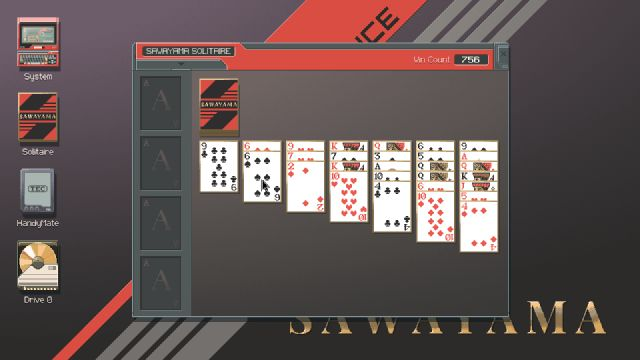
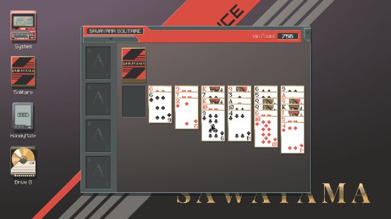

# Solitaire transfer through MCP

On 2026-09-17, Ganglion's existing drag primitive handled a legal move and a rejected drop in
**The Zachtronics Solitaire Collection / Sawayama** inside Anode session 3, at 1280×720.
The game was build 24998607 (Steam app 1988540). The resident core needed no changes.

## Recorded outcomes

| Case | Observed application result | Core result | Wall time from intent call |
|---|---|---|---:|
| Nine of clubs onto six of spades | Card snaps back; source remains occupied | `failed`, `condition_not_observed` | 1.928 s |
| Nine of clubs onto ten of hearts | Source becomes empty; nine remains on ten | `completed`, `condition_observed_after_release` | 0.995 s |

These are two individual functional checks, not a latency distribution or full-game benchmark.
Each attempt recorded exactly one `drag_started` and one `input_released`, no pending output,
no input failures, and no ledger gaps. The core ended halted. Runtime capture counts in the first
report include its idle period before evaluation: 11,488 DXGI samples, 11 GDI samples, and nine
dropped observations. They are not trial-only throughput measurements.

[Full report and ledger](results/solitaire-seat/report.json) ·
[Taught profile](profiles/sawayama-seat.json) ·
[Changed-board refusal](results/solitaire-seat/changed-board-refusal.json)

Before the accepted move:



After release and verification:



These JPEGs are the native images returned by `ganglion_look`, scaled to 640 pixels wide. The
gameplay was also visually checked in a full-size Anode capture. The report retains both
predicate observations and stage timestamps. There is no application-internal truth hook here.

## Teaching and execution

An agent inspected the actual tableau and identified the cards. The profile taught a white card
surface in the source region and initially empty regions below each destination. A matching
destination extension triggered release and had to persist in fresh samples after release.
A separate delayed observation checked both the vacated/restored source and destination.
The accepted drag released at cursor [692, 407], before its [698, 409] destination, then verified
the condition from samples acquired after release. The rejected attempt reached its destination
but could not verify a persistent extension.

`ganglion.evaluation.transfer` attaches to an explicitly launched core through the real MCP
stdio bridge. It claims a bounded lease, teaches named watches, checks preconditions, performs
the listed intents, drains the ledger, saves images, and halts. It never launches, focuses,
deals, resets, or closes the application. Session and client-size mismatches reject the run.
Output directories must be new, so earlier evidence is not overwritten.

Reusing the original profile after the accepted move correctly refused input: its source was
empty and its destination extension was already present. This is a check for the changes those
predicates describe. Another board can share those colours, so **compare the actual cards and
layout visually before using or adapting the profile**. It is not a rank/suit recognizer.

After preparing the intended board and starting a core in the verified seat:

```powershell
# Run this core inside Anode; substitute its verified game HWND and a new endpoint path.
.venv/Scripts/python.exe -m ganglion.cli core --window 123456 --seconds 120 --endpoint runs/solitaire.endpoint.json
```

The evaluator may run from either session because its only control channel is the core's
authenticated loopback MCP bridge. The profile's expected session must match the verified seat:

```powershell
.venv/Scripts/python.exe -m ganglion.evaluation.transfer --endpoint runs/solitaire.endpoint.json --profile docs/bench/profiles/sawayama-seat.json --out runs/solitaire-check
```

The retained profile documents the observed board, not a way to recreate its deal. Do not replay
it on a newly dealt or differently scaled board without re-teaching. No game saves are distributed.

## Steam launch limitation and cleanup

The first `seat_run` started the executable in session 3, but the game redirected through Steam.
Steam's bootstrap log recorded the original client's shutdown and a new seat client startup.
The gameplay checks above then ran successfully in the seat. A `steam.exe` launch process
remained in session 1, but its presence did not establish a usable main-desktop Steam UI.

After recording results, the owned game and seat Steam client were closed normally, the pending
launch process from the earlier desktop attempt was stopped, and Steam was restarted silently
on the main desktop. Main-session Steam UI helpers were verified there.

A second experiment temporarily supplied the installed game's own app ID in `steam_appid.txt`.
Valve documents this as a way to avoid the automatic Steam relaunch during development/testing
([Steamworks API documentation](https://partner.steamgames.com/doc/api/steam_api?language=english#SteamAPI_RestartAppIfNecessary)).
It avoided the client migration, but the seat game stopped with “You must start Steam before
launching the game” while the main client remained active. The dialog was dismissed and the
temporary file removed. This suggests a Steam initialization/session limitation for this build;
it does not establish that every Steam game behaves the same way.

The game, test core, and seat Steam client are closed after cleanup; the main Steam client is
running. Main-desktop Computer Use was not used during these seat tests. Concurrent main-Steam
and seat-game operation remains an open launch problem, documented in
[the follow-up investigation](../../suggestions/solitaire-steam-session.md).

## Validation and limits

The suite passes **88 tests** with the three optional Edge checks, or **85 tests plus three
skips** in the clean deterministic environment. Seven new tests cover MCP execution, independent
fixture acceptance, wrong-session refusal before claiming control, changed-precondition refusal
before input, and malformed profiles. Locked dependency resolution and wheel build pass; the
evaluation module is included in the wheel. Remote CI has not been run here.

This establishes transfer of the existing primitive to one real game board. Card recognition,
stack tracking, autonomous move selection, full-game completion, and repeated-trial reliability
remain untested. `condition_verified` still describes only a taught pixel predicate;
`task_success_verified` remains false in the core. The evaluator adds the application-specific
interpretation and saved visual evidence.
